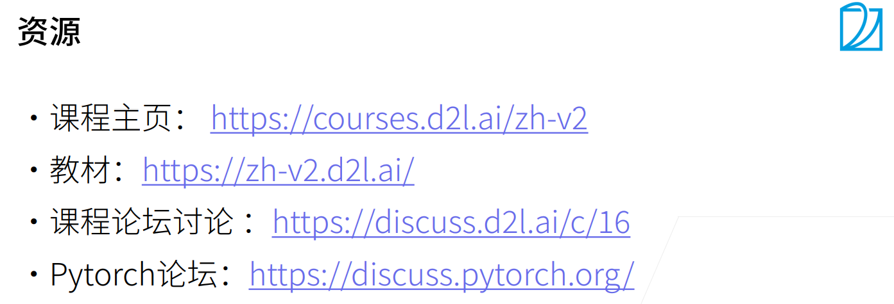
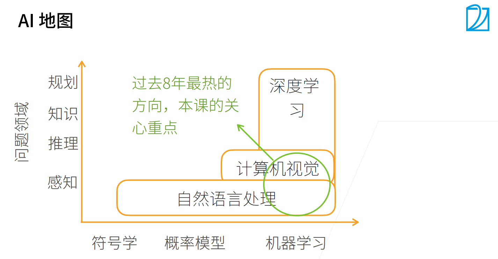
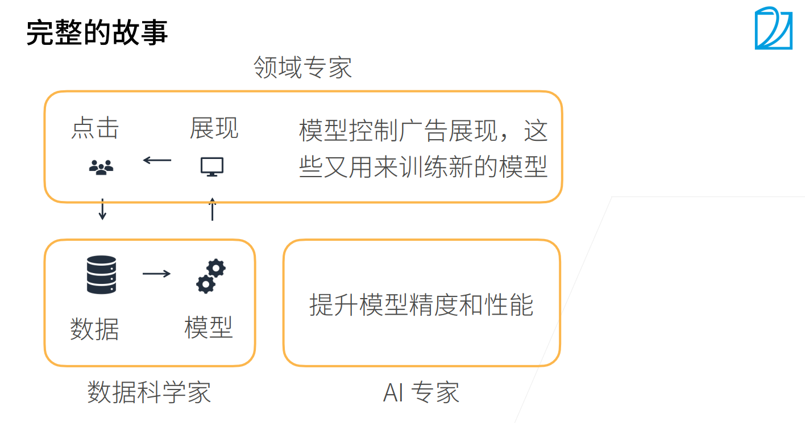

## 01课程安排-02深度学习介绍

> Date: 2021.11.19

### **课程资源&安排**

### **现状介绍**

- 感知--> 推理--> 知识--> 规划
- 符号学--> 概率模型--> 机器学习
- 自然语言处理--> 机器视觉--> 深度学习（机器学习的一种）
- 最热门的方向（深度学习+自然语言处理+计算机视觉）

### **深度学习发展历史、应用领域**

1. 图片分类
2. 物体检测与分割
3. 样式迁移，人脸合成
4. 文字生成图片
5. 文字生成，代码生成
6. 无人驾驶

### **Q&A**
1. 机器学习在图片分割领域为什么有效（模型的可解释性）？
2. 深度学习模型可以用数学表述；
3. 对于为什么工作，为什么不工作难以用数学语言解释。
4. 数据科学家：将问题抽象为数据问题，进行建模处理；领域专家：应用模型控制展现，这些数据又用来训练新的模型。