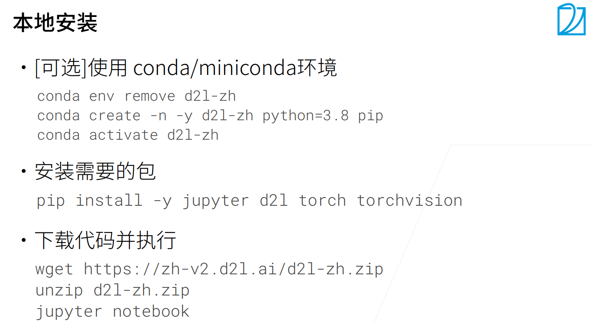

## Installation

> Date: 2021.11.19


### **本地安装（CPU安装）**



### **Bash command**
``` bash
# make sure your os is updated
$ sudo apt update ; sudo apt upgrade ;

# install python
$ python3 --version # check your python version
# install python if needed

# install miniconda with corresponding version
$ wget https://repo.anaconda.com/miniconda/Miniconda3-py38_4.10.3-Linux-x86_64.sh
$ bash Miniconda3-py38_4.10.3-Linux-x86_64.sh   # install 
$ conda config --set auto_activate_base false   # avoiding miniconda-base start at boot
$ conda activate base   # active miniconda-base
$ conda deactivate      # deactivate miniconda-base

# conda env
$ conda env remove -n d2l  # remove specified environment
$ conda create -n d2l -y python=3.8 pip
$ conda activate d2l

# install necessary packages
$ pip install jupyter d2l
$ pip install torch torchvision 
-i http://mirrors.aliyun.com/pypi/simple/  --trusted-host mirrors.aliyun.com  # aliyun resources
-i https://pypi.tuna.tsinghua.edu.cn/simple --trusted-host pypi.tuna.tsinghua.edu.cn  # # tsinghua resources

# download jupyter notebook
$ wget https://zh-v2.d2l.ai/d2l-zh.zip
$ unzip d2l-zh.zip
$ jupyter notebook

# map remote URL to localhost

# allow jupyter notebook remove access 
$ jupyter notebook --generate-config
# generate password in python
$ ipython
In [1]: from notebook.auth import passwd
In [2]: passwd()
# modify configuration
$ vim ~/.jupyter/jupyter_notebook_config.py
c.NotebookApp.ip = 'ip' # '*' or '0.0.0.0'
c.NotebookApp.password = 'passwd'
c.NotebookApp.open_browser = False
c.NotebookApp.port = 8888   # port
c.NotebookApp.allow_remote_access = True
c.NotebookApp.notebook_dir = 'dir'    # root directory
```